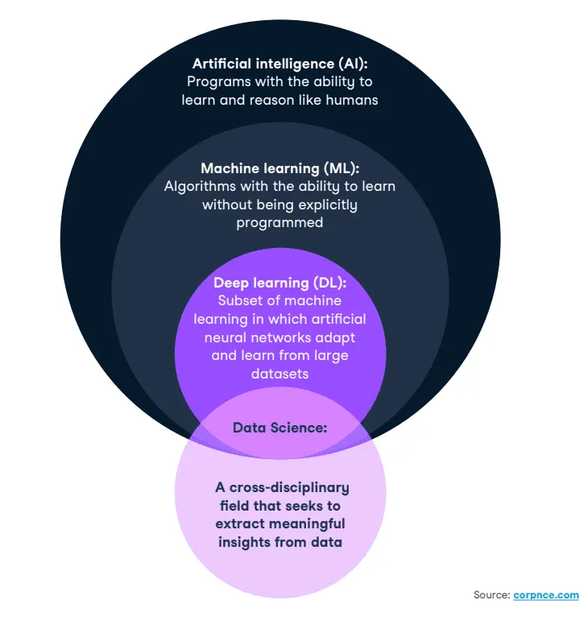

# Introduction

This article contains a structured learning path with steps for learning AI from basic to advanced level.

## 1. [How Dave Would Learn AI in 2025](https://www.youtube.com/watch?v=h2FDq3agImI&t=10s)
In this video, Dave provides 7 steps to correctly learn AI from zero in the early stage of AI revolution.
He starts by discussing some misconceptions around AI, e.g. 
- all the hypes surrounding AI, like a lot of videos about using no-code/low-code tools to create AI and automation;
but learning AI in depths requires coding
- AI has been around since 1950s, but now it's all about the ChatGPT hype; it's important to understand AI as umbrella term

Dave's channel focuses on learning by doing/reverse-engineering.

The 7 steps:
1. Setup Work Environment: Python and its virtual environment (I'd suggest to use uv)
2. Learn Python Basics & data related libraries: Pandas, numpy
3. Learn Git and GitHub Basics
4. Work on Projects & Build Portfolio: reverse engineer existing projects and explore different AI areas,
also see Kaggle & ProjectPro
5. Pick Specialisation & Share Knowledge
6. Continue Learning & Upskill: for data professionals, learning software engineering skills is essential
7. Monetise Skills

Click to view AI Learning Mindmap

## 2. [Dave's 7 Lessons for New AI Engineers - A Beginner's Guide](https://www.youtube.com/watch?v=IycFShi7J80&t=333s)